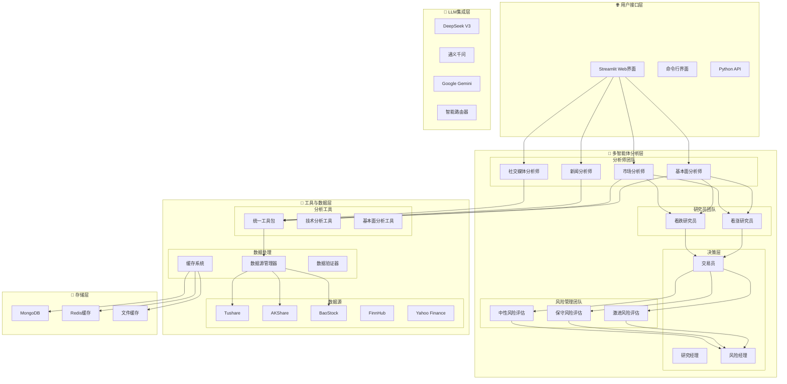
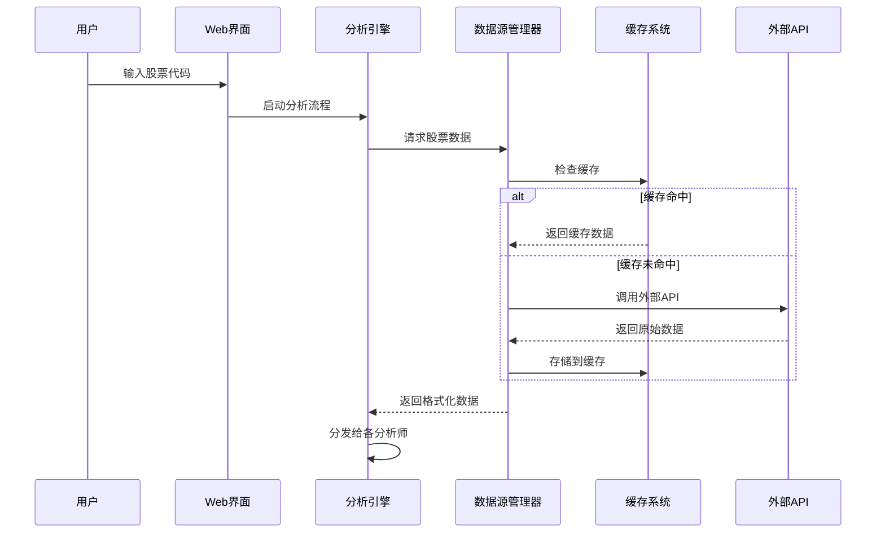
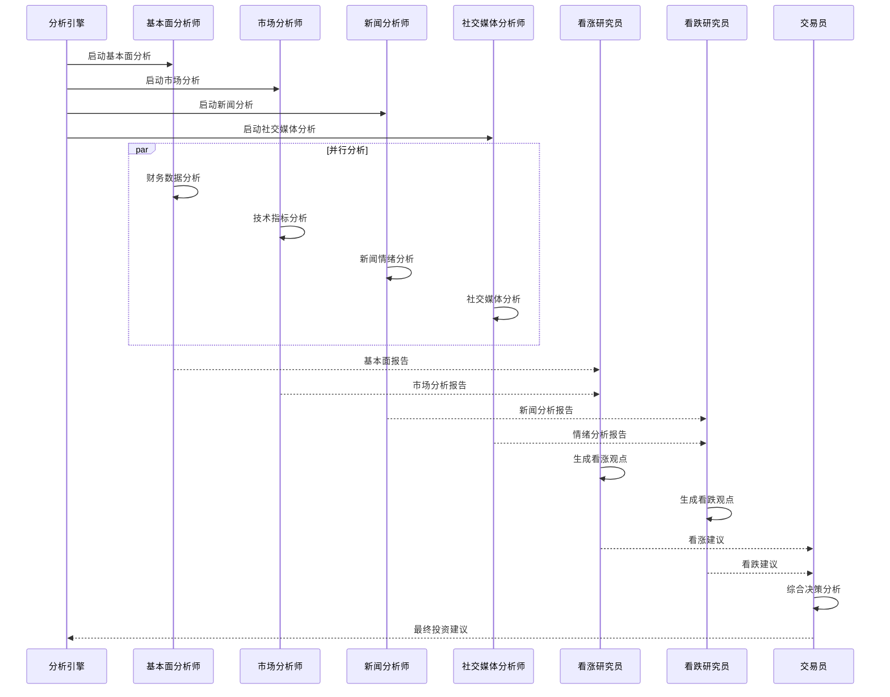
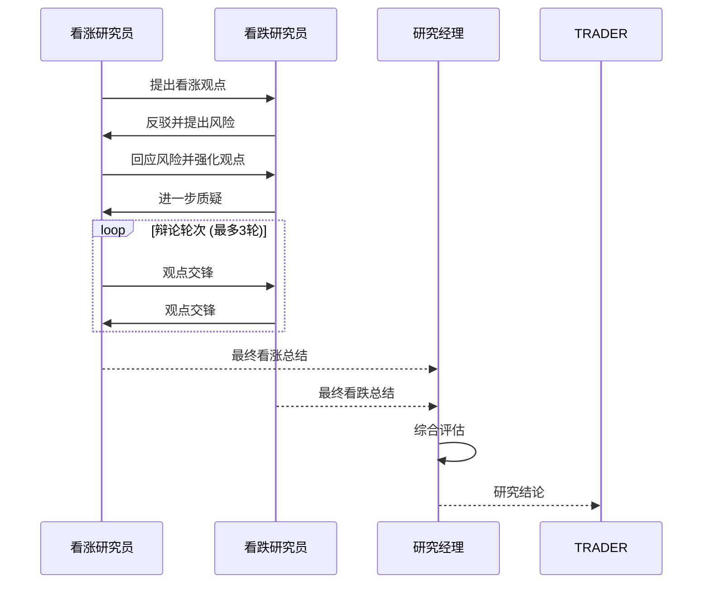
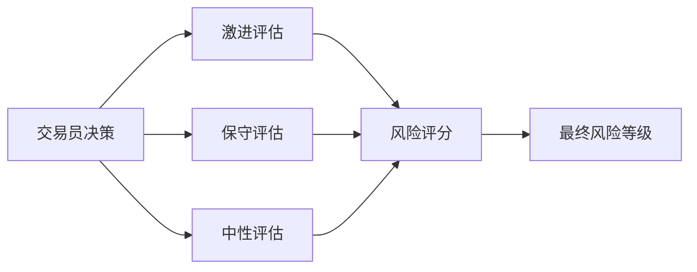

# TradingAgents-CN 股票分析系统详细设计文档

## 📋 文档概述

本文档详细描述了TradingAgents-CN股票分析系统的完整架构、数据流程、模块协作机制以及各组件的输入输出规范。

**版本**: v0.1.7  
**更新日期**: 2025-07-16  
**作者**: TradingAgents-CN团队

---

## 🎯 系统总览

### 核心理念
TradingAgents-CN采用**多智能体协作**的设计理念，模拟真实金融机构的分析团队，通过专业化分工和协作机制，实现全面、客观的股票投资分析。

### 设计原则
1. **专业化分工**: 每个智能体专注特定领域的分析
2. **协作决策**: 通过辩论和协商机制形成最终决策
3. **数据驱动**: 基于真实市场数据进行分析
4. **风险控制**: 多层次风险评估和管理
5. **可扩展性**: 支持新增分析师和数据源

---

## 🏗️ 系统架构

### 整体架构图



---

## 📊 数据流程设计

### 1. 数据获取流程



### 2. 分析师协作流程



---

## 🤖 智能体详细设计

### 1. 基本面分析师 (Fundamentals Analyst)

#### 输入数据
```json
{
    "ticker": "002027",
    "start_date": "2025-06-01",
    "end_date": "2025-07-15",
    "curr_date": "2025-07-15"
}
```

#### 处理流程
1. **数据获取**: 调用统一基本面工具获取财务数据
2. **指标计算**: 计算PE、PB、ROE、ROA等关键指标
3. **行业分析**: 基于股票代码判断行业特征
4. **估值分析**: 评估股票估值水平
5. **报告生成**: 生成结构化基本面分析报告

#### 输出格式
```markdown
# 中国A股基本面分析报告 - 002027

## 📊 股票基本信息
- **股票代码**: 002027
- **股票名称**: 分众传媒
- **所属行业**: 广告包装
- **当前股价**: ¥7.67
- **涨跌幅**: -1.41%

## 💰 财务数据分析
### 估值指标
- **PE比率**: 18.5倍
- **PB比率**: 1.8倍
- **PS比率**: 2.5倍

### 盈利能力
- **ROE**: 12.8%
- **ROA**: 6.2%
- **毛利率**: 25.5%

## 📈 投资建议
基于当前财务指标分析，建议...
```

### 2. 市场分析师 (Market Analyst)

#### 输入数据
```json
{
    "ticker": "002027",
    "period": "1y",
    "indicators": ["SMA", "EMA", "RSI", "MACD"]
}
```

#### 处理流程
1. **价格数据获取**: 获取历史价格和成交量数据
2. **技术指标计算**: 计算移动平均线、RSI、MACD等
3. **趋势分析**: 识别价格趋势和支撑阻力位
4. **成交量分析**: 分析成交量变化模式
5. **图表分析**: 生成技术分析图表

#### 输出格式
```markdown
# 市场技术分析报告 - 002027

## 📈 价格趋势分析
- **当前趋势**: 震荡下行
- **支撑位**: ¥7.12
- **阻力位**: ¥7.87

## 📊 技术指标
- **RSI**: 45.2 (中性)
- **MACD**: 负值，下行趋势
- **成交量**: 相对活跃

## 🎯 技术面建议
基于技术指标分析，短期内...
```

### 3. 新闻分析师 (News Analyst)

#### 输入数据
```json
{
    "ticker": "002027",
    "company_name": "分众传媒",
    "date_range": "7d",
    "sources": ["google_news", "finnhub_news"]
}
```

#### 处理流程
1. **新闻获取**: 从多个新闻源获取相关新闻
2. **情绪分析**: 分析新闻的正面/负面情绪
3. **事件识别**: 识别重要的公司和行业事件
4. **影响评估**: 评估新闻对股价的潜在影响
5. **报告整合**: 生成新闻分析摘要

#### 输出格式
```markdown
# 新闻分析报告 - 002027

## 📰 重要新闻事件
### 近期新闻摘要
- **正面新闻**: 3条
- **负面新闻**: 1条
- **中性新闻**: 5条

### 关键事件
1. 公司发布Q2财报，业绩超预期
2. 行业监管政策调整
3. 管理层变动公告

## 📊 情绪分析
- **整体情绪**: 偏正面 (65%)
- **市场关注度**: 中等
- **预期影响**: 短期正面

## 🎯 新闻面建议
基于新闻分析，建议关注...
```

### 4. 社交媒体分析师 (Social Media Analyst)

#### 输入数据
```json
{
    "ticker": "002027",
    "platforms": ["weibo", "xueqiu", "reddit"],
    "sentiment_period": "7d"
}
```

#### 处理流程
1. **社交数据获取**: 从微博、雪球等平台获取讨论数据
2. **情绪计算**: 计算投资者情绪指数
3. **热度分析**: 分析讨论热度和关注度
4. **观点提取**: 提取主要的投资观点
5. **趋势识别**: 识别情绪变化趋势

#### 输出格式
```markdown
# 社交媒体情绪分析报告 - 002027

## 📱 平台数据概览
- **微博讨论**: 1,234条
- **雪球关注**: 5,678人
- **Reddit提及**: 89次

## 📊 情绪指标
- **整体情绪**: 中性偏乐观 (58%)
- **情绪波动**: 低
- **关注热度**: 中等

## 💭 主要观点
### 看涨观点
- 基本面改善预期
- 行业复苏信号

### 看跌观点
- 估值偏高担忧
- 宏观环境不确定

## 🎯 情绪面建议
基于社交媒体分析，投资者情绪...
```

---

## 🔄 协作机制设计

### 1. 研究员辩论机制

#### 看涨研究员 (Bull Researcher)
- **输入**: 基本面报告 + 市场分析报告
- **职责**: 从乐观角度分析投资机会
- **输出**: 看涨投资建议和理由

#### 看跌研究员 (Bear Researcher)
- **输入**: 新闻分析报告 + 社交媒体报告
- **职责**: 从悲观角度分析投资风险
- **输出**: 看跌投资建议和风险警示

#### 辩论流程


### 2. 风险评估机制

#### 三层风险评估
1. **激进风险评估**: 评估高风险高收益策略
2. **保守风险评估**: 评估低风险稳健策略
3. **中性风险评估**: 平衡风险收益评估

#### 风险评估流程


---

## 🛠️ 技术实现细节

### 1. 数据源管理

#### 数据源优先级
```python
class ChinaDataSource(Enum):
    TUSHARE = "tushare"      # 优先级1: 专业金融数据
    AKSHARE = "akshare"      # 优先级2: 开源金融数据
    BAOSTOCK = "baostock"    # 优先级3: 备用数据源
    TDX = "tdx"              # 优先级4: 通达信数据
```

#### 数据获取策略
1. **主数据源**: 优先使用Tushare获取数据
2. **故障转移**: 主数据源失败时自动切换到备用源
3. **数据验证**: 验证数据完整性和准确性
4. **缓存机制**: 缓存数据以提高性能

### 2. 缓存系统设计

#### 多层缓存架构
```python
class CacheManager:
    def __init__(self):
        self.memory_cache = {}      # 内存缓存 (最快)
        self.redis_cache = Redis()  # Redis缓存 (中等)
        self.file_cache = {}        # 文件缓存 (持久)
        self.db_cache = MongoDB()   # 数据库缓存 (最持久)
```

#### 缓存策略
- **热数据**: 存储在内存缓存中，TTL=1小时
- **温数据**: 存储在Redis中，TTL=24小时
- **冷数据**: 存储在文件系统中，TTL=7天
- **历史数据**: 存储在MongoDB中，永久保存

### 3. LLM集成架构

#### 多模型支持
```python
class LLMRouter:
    def __init__(self):
        self.models = {
            "deepseek": DeepSeekAdapter(),
            "qwen": QwenAdapter(),
            "gemini": GeminiAdapter()
        }

    def route_request(self, task_type, content):
        # 根据任务类型选择最适合的模型
        if task_type == "analysis":
            return self.models["deepseek"]
        elif task_type == "summary":
            return self.models["qwen"]
        else:
            return self.models["gemini"]
```

#### 模型选择策略
- **深度分析**: 使用DeepSeek V3 (推理能力强)
- **快速总结**: 使用通义千问 (速度快)
- **多语言处理**: 使用Gemini (多语言支持好)

---

## 📈 性能优化设计

### 1. 并行处理机制

#### 分析师并行执行
```python
async def run_analysts_parallel(state):
    tasks = [
        run_fundamentals_analyst(state),
        run_market_analyst(state),
        run_news_analyst(state),
        run_social_analyst(state)
    ]

    results = await asyncio.gather(*tasks)
    return combine_results(results)
```

### 2. 资源管理

#### API调用限制
- **请求频率**: 每秒最多10次API调用
- **并发控制**: 最多5个并发请求
- **重试机制**: 失败时指数退避重试
- **熔断器**: 连续失败时暂停调用

#### 内存管理
- **对象池**: 复用LLM实例减少初始化开销
- **垃圾回收**: 及时清理大型数据对象
- **内存监控**: 监控内存使用情况防止泄漏

---

## 🔒 安全与可靠性

### 1. 数据安全

#### API密钥管理
```python
class SecureConfig:
    def __init__(self):
        self.api_keys = {
            "tushare": os.getenv("TUSHARE_TOKEN"),
            "deepseek": os.getenv("DEEPSEEK_API_KEY"),
            "dashscope": os.getenv("DASHSCOPE_API_KEY")
        }

    def validate_keys(self):
        # 验证API密钥格式和有效性
        pass
```

#### 数据加密
- **传输加密**: 所有API调用使用HTTPS
- **存储加密**: 敏感数据加密存储
- **访问控制**: 基于角色的访问控制

### 2. 错误处理

#### 分层错误处理
```python
class ErrorHandler:
    def handle_data_error(self, error):
        # 数据获取错误处理
        logger.error(f"数据获取失败: {error}")
        return self.fallback_data_source()

    def handle_llm_error(self, error):
        # LLM调用错误处理
        logger.error(f"LLM调用失败: {error}")
        return self.fallback_llm_model()

    def handle_analysis_error(self, error):
        # 分析过程错误处理
        logger.error(f"分析失败: {error}")
        return self.generate_error_report()
```

---

## 📊 监控与日志

### 1. 日志系统

#### 分层日志记录
```python
# 系统级日志
logger.info("🚀 系统启动")

# 模块级日志
logger.info("📊 [基本面分析师] 开始分析")

# 调试级日志
logger.debug("🔍 [DEBUG] API调用参数: {params}")

# 错误级日志
logger.error("❌ [ERROR] 数据获取失败: {error}")
```

#### 日志分类
- **系统日志**: 系统启动、关闭、配置变更
- **业务日志**: 分析流程、决策过程、结果输出
- **性能日志**: 响应时间、资源使用、API调用统计
- **错误日志**: 异常信息、错误堆栈、恢复过程

### 2. 性能监控

#### 关键指标监控
- **响应时间**: 各分析师的执行时间
- **成功率**: API调用和分析的成功率
- **资源使用**: CPU、内存、网络使用情况
- **用户体验**: 页面加载时间、交互响应时间

---

## 🚀 部署与扩展

### 1. 容器化部署

#### Docker Compose配置
```yaml
version: '3.8'
services:
  web:
    build: .
    ports:
      - "8501:8501"
    environment:
      - TUSHARE_TOKEN=${TUSHARE_TOKEN}
      - DEEPSEEK_API_KEY=${DEEPSEEK_API_KEY}
    depends_on:
      - mongodb
      - redis

  mongodb:
    image: mongo:latest
    ports:
      - "27017:27017"
    volumes:
      - mongodb_data:/data/db

  redis:
    image: redis:alpine
    ports:
      - "6379:6379"
```

### 2. 扩展性设计

#### 水平扩展
- **负载均衡**: 多个Web实例负载均衡
- **数据库分片**: MongoDB分片存储大量历史数据
- **缓存集群**: Redis集群提高缓存性能

#### 垂直扩展
- **新增分析师**: 插件式添加新的分析师类型
- **新增数据源**: 统一接口集成新的数据提供商
- **新增LLM**: 适配器模式支持新的语言模型

---

## 📋 总结

TradingAgents-CN股票分析系统通过多智能体协作、数据驱动分析、风险控制机制等设计，实现了专业、全面、可靠的股票投资分析。系统具备良好的扩展性、可维护性和性能表现，能够满足个人投资者和机构用户的多样化需求。

### 核心优势
1. **专业分工**: 模拟真实投资团队的专业化分工
2. **协作决策**: 通过辩论机制形成客观决策
3. **数据驱动**: 基于真实市场数据进行分析
4. **风险控制**: 多层次风险评估和管理
5. **技术先进**: 集成最新的AI和大语言模型技术

### 应用场景
- **个人投资**: 为个人投资者提供专业分析建议
- **机构研究**: 为投资机构提供研究支持
- **教育培训**: 为金融教育提供实践平台
- **量化策略**: 为量化投资提供信号支持
```
