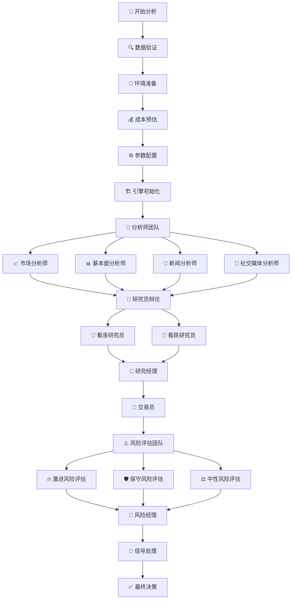

# 📊 TradingAgents 分析节点和工具完整指南

## 📋 概述

TradingAgents 采用多智能体协作架构，通过专业分工和结构化流程实现全面的股票分析。本文档详细介绍了系统中的所有分析节点、工具配置以及数据流转过程。

## 🔄 完整分析流程

### 流程图


### 执行顺序
1. **初始化阶段** (步骤1-5): 系统准备和配置
2. **分析师阶段** (步骤6): 并行数据分析
3. **研究阶段** (步骤7-8): 观点辩论和共识形成
4. **决策阶段** (步骤9-11): 交易决策和风险评估
5. **输出阶段** (步骤12-13): 信号处理和最终决策

## 👥 分析节点详细说明

### 🔍 1. 分析师团队 (Analysts)

#### 📈 市场分析师 (Market Analyst)
**职责**: 技术分析、价格趋势、市场情绪

**核心功能**:
- 技术指标计算 (MA, RSI, MACD, 布林带)
- 价格趋势识别
- 支撑阻力位分析
- 成交量分析
- 交易信号生成

**使用工具**:
```python
# 主要工具
- get_stock_market_data_unified    # 统一市场数据 (推荐)
- get_YFin_data_online            # Yahoo Finance 在线数据
- get_stockstats_indicators_report_online  # 在线技术指标

# 备用工具
- get_YFin_data                   # Yahoo Finance 离线数据
- get_stockstats_indicators_report # 离线技术指标
```

**数据源映射**:
- **A股**: Tushare + AKShare 技术指标
- **港股**: AKShare + Yahoo Finance
- **美股**: Yahoo Finance + FinnHub

#### 📊 基本面分析师 (Fundamentals Analyst)
**职责**: 财务分析、估值模型、基本面指标

**核心功能**:
- 财务报表分析
- DCF估值模型
- 比较估值法 (P/E, P/B, EV/EBITDA)
- 行业基准对比
- 盈利质量评估

**使用工具**:
```python
# 主要工具
- get_stock_fundamentals_unified   # 统一基本面分析 (推荐)

# 补充工具
- get_finnhub_company_insider_sentiment      # 内部人士情绪
- get_finnhub_company_insider_transactions   # 内部人士交易
- get_simfin_balance_sheet        # 资产负债表
- get_simfin_cashflow            # 现金流量表
- get_simfin_income_stmt         # 利润表
```

**数据源映射**:
- **A股**: Tushare 财务数据 + AKShare 基本面
- **港股**: AKShare 基本面数据
- **美股**: FinnHub + SimFin 财务数据

#### 📰 新闻分析师 (News Analyst)
**职责**: 新闻事件分析、宏观经济影响评估

**核心功能**:
- 实时新闻监控
- 事件影响评估
- 宏观经济分析
- 政策影响分析
- 行业动态跟踪

**使用工具**:
```python
# 在线工具
- get_realtime_stock_news         # 实时股票新闻
- get_global_news_openai         # 全球新闻 (OpenAI)
- get_google_news               # Google 新闻

# 离线工具
- get_finnhub_news              # FinnHub 新闻
- get_reddit_news               # Reddit 新闻
```

#### 💬 社交媒体分析师 (Social Media Analyst)
**职责**: 社交媒体情绪、投资者情绪分析

**核心功能**:
- 投资者情绪监控
- 社交媒体热度分析
- 意见领袖观点跟踪
- 散户情绪评估
- 情绪价格影响分析

**使用工具**:
```python
# 在线工具
- get_stock_news_openai          # 股票新闻情绪 (OpenAI)

# 离线工具
- get_reddit_stock_info          # Reddit 股票讨论
- get_chinese_social_sentiment   # 中国社交媒体情绪
```

### 🎯 2. 研究员团队 (Researchers)

#### 🐂 看涨研究员 (Bull Researcher)
**职责**: 从乐观角度评估投资机会

**分析重点**:
- 增长潜力和市场机会
- 竞争优势和护城河
- 积极催化剂识别
- 估值吸引力评估
- 反驳看跌观点

**工作方式**: 基于LLM推理，结合历史记忆和经验

#### 🐻 看跌研究员 (Bear Researcher)
**职责**: 从悲观角度评估投资风险

**分析重点**:
- 潜在风险因素识别
- 市场威胁和挑战
- 负面催化剂评估
- 估值过高风险
- 反驳看涨观点

**工作方式**: 基于LLM推理，结合历史记忆和经验

### 👔 3. 管理层 (Managers)

#### 🎯 研究经理 (Research Manager)
**职责**: 协调研究员辩论，形成研究共识

**核心功能**:
- 主持看涨/看跌研究员辩论
- 评估双方论点质量和说服力
- 平衡不同观点
- 形成综合投资建议
- 质量控制和标准制定

**决策逻辑**:
```python
# 评估标准
- 论点逻辑性和证据支持
- 数据质量和可靠性
- 风险收益平衡
- 市场时机判断
- 历史经验参考
```

#### ⚖️ 风险经理 (Risk Manager)
**职责**: 管理整体风险控制流程

**核心功能**:
- 协调风险评估团队工作
- 制定风险管理政策
- 监控关键风险指标
- 做出最终风险决策
- 风险限额管理

### 💰 4. 交易执行 (Trading)

#### 💼 交易员 (Trader)
**职责**: 制定最终交易决策

**决策输入**:
- 所有分析师报告
- 研究员辩论结果
- 风险评估结论
- 市场条件评估
- 历史交易经验

**输出内容**:
```python
# 交易建议格式
{
    "action": "买入/持有/卖出",
    "confidence": "置信度 (1-10)",
    "target_price": "目标价格",
    "stop_loss": "止损价格",
    "position_size": "建议仓位",
    "time_horizon": "投资期限",
    "reasoning": "决策理由"
}
```

### ⚠️ 5. 风险管理团队 (Risk Management)

#### 🔥 激进风险评估 (Risky Analyst)
**风险偏好**: 高风险高收益
**关注点**: 最大化收益潜力，接受较高波动

#### 🛡️ 保守风险评估 (Safe Analyst)
**风险偏好**: 低风险稳健
**关注点**: 资本保护，风险最小化

#### ⚖️ 中性风险评估 (Neutral Analyst)
**风险偏好**: 平衡风险收益
**关注点**: 理性评估，适中风险

### 🔧 6. 信号处理 (Signal Processing)

#### 📡 信号处理器 (Signal Processor)
**职责**: 整合所有智能体输出，生成最终决策

**处理流程**:
1. 收集所有智能体输出
2. 权重分配和重要性评估
3. 冲突解决和一致性检查
4. 生成结构化投资信号
5. 输出最终决策建议

## 🔧 统一工具架构

### 🎯 核心优势

#### 智能路由
```python
# 自动识别股票类型并路由到最佳数据源
get_stock_market_data_unified(ticker, start_date, end_date)
get_stock_fundamentals_unified(ticker, start_date, end_date)
```

#### 数据源映射
| 股票类型 | 市场数据 | 基本面数据 | 新闻数据 |
|---------|---------|-----------|---------|
| **A股** | Tushare + AKShare | Tushare + AKShare | 财联社 + 新浪财经 |
| **港股** | AKShare + Yahoo | AKShare | Google News |
| **美股** | Yahoo + FinnHub | FinnHub + SimFin | FinnHub + Google |

### 🔄 工具调用机制

每个分析师都遵循LangGraph的工具调用循环：

```python
# 工具调用循环
分析师节点 → 条件判断 → 工具节点 → 回到分析师节点
    ↓           ↓           ↓           ↓
  决定调用工具  → 检查工具调用 → 执行数据获取 → 处理数据生成报告
```

**循环说明**:
1. **第一轮**: 分析师决定需要什么数据 → 调用相应工具
2. **第二轮**: 分析师处理获取的数据 → 生成分析报告
3. **完成**: 没有更多工具调用需求 → 进入下一个分析师

## 🧠 LLM工具选择逻辑

### 🎯 核心选择机制

LLM并不会调用ToolNode中的所有工具，而是基于以下逻辑智能选择：

#### 1️⃣ 系统提示词的明确指导
```python
# 市场分析师的系统提示词
**工具调用指令：**
你有一个工具叫做get_stock_market_data_unified，你必须立即调用这个工具来获取{company_name}（{ticker}）的市场数据。
不要说你将要调用工具，直接调用工具。
```

#### 2️⃣ 工具描述的匹配度
| 工具名称 | 描述 | 参数复杂度 | 匹配度 |
|---------|------|-----------|--------|
| `get_stock_market_data_unified` | **统一的股票市场数据工具，自动识别股票类型** | 简单(3个参数) | ⭐⭐⭐⭐⭐ |
| `get_YFin_data_online` | Retrieve stock price data from Yahoo Finance | 简单(3个参数) | ⭐⭐⭐ |
| `get_stockstats_indicators_report_online` | Retrieve stock stats indicators | 复杂(4个参数) | ⭐⭐ |

#### 3️⃣ 工具名称的语义理解
- `unified` = 统一的，全面的
- `online` = 在线的，实时的
- `indicators` = 指标，更专业

#### 4️⃣ 参数简洁性偏好
```python
# 统一工具 - 3个参数，简单明了
get_stock_market_data_unified(ticker, start_date, end_date)

# 技术指标工具 - 4个参数，需要额外指定indicator
get_stockstats_indicators_report_online(symbol, indicator, curr_date, look_back_days)
```

### 🔍 LLM的决策过程

```
1. 任务理解: "需要对股票进行技术分析"
2. 工具扫描: 查看可用的5个工具
3. 描述匹配: "统一工具"最符合"全面分析"需求
4. 指令遵循: 系统提示明确要求调用unified工具
5. 参数简单: unified工具参数最简洁
6. 决策结果: 选择get_stock_market_data_unified
```

### 🎯 工具池的分层设计

ToolNode中的多个工具形成**分层备用体系**：

```
第1层: get_stock_market_data_unified (首选)
第2层: get_YFin_data_online (在线备用)
第3层: get_stockstats_indicators_report_online (专业备用)
第4层: get_YFin_data (离线备用)
第5层: get_stockstats_indicators_report (最后备用)
```

### 📊 实际调用验证

**A股分析日志示例**:
```
📊 [DEBUG] 选择的工具: ['get_stock_market_data_unified']
📊 [市场分析师] 工具调用: ['get_stock_market_data_unified']
📈 [统一市场工具] 分析股票: 000858
📈 [统一市场工具] 股票类型: 中国A股
🇨🇳 [统一市场工具] 处理A股市场数据...
```

**结论**: LLM实际只调用1个工具，而非所有5个工具！

## 🔄 基本面分析师的多轮调用机制

### ❓ 为什么基本面分析师会多轮调用？

与市场分析师不同，基本面分析师有一个特殊的**强制工具调用机制**，这是为了解决某些LLM（特别是阿里百炼）不调用工具的问题。

### 🔧 多轮调用的具体流程

#### 第1轮：正常工具调用尝试
```python
# 基本面分析师首先尝试让LLM自主调用工具
result = chain.invoke(state["messages"])

if hasattr(result, 'tool_calls') and len(result.tool_calls) > 0:
    # ✅ LLM成功调用了工具
    logger.info(f"📊 [基本面分析师] 工具调用: {tool_calls_info}")
    return {"messages": [result]}  # 进入工具执行阶段
```

#### 第2轮：工具执行
```python
# LangGraph执行工具调用，获取数据
tool_result = get_stock_fundamentals_unified.invoke(args)
# 返回到分析师节点处理数据
```

#### 第3轮：数据处理和报告生成
```python
# 分析师处理工具返回的数据，生成最终报告
final_result = llm.invoke(messages_with_tool_data)
return {"fundamentals_report": final_result.content}
```

#### 🚨 强制工具调用机制（备用方案）
```python
else:
    # ❌ LLM没有调用工具，启动强制机制
    logger.debug(f"📊 [DEBUG] 检测到模型未调用工具，启用强制工具调用模式")

    # 直接调用工具获取数据
    unified_tool = find_tool('get_stock_fundamentals_unified')
    combined_data = unified_tool.invoke({
        'ticker': ticker,
        'start_date': start_date,
        'end_date': current_date,
        'curr_date': current_date
    })

    # 使用获取的数据重新生成分析报告
    analysis_prompt = f"基于以下真实数据，对{company_name}进行详细的基本面分析：\n{combined_data}"
    final_result = llm.invoke(analysis_prompt)

    return {"fundamentals_report": final_result.content}
```

### 📊 多轮调用的日志示例

**正常情况（3轮）**:
```
📊 [模块开始] fundamentals_analyst - 股票: 000858
📊 [基本面分析师] 工具调用: ['get_stock_fundamentals_unified']  # 第1轮：决定调用工具
📊 [统一基本面工具] 分析股票: 000858                           # 第2轮：执行工具
📊 [模块完成] fundamentals_analyst - ✅ 成功 - 耗时: 45.32s    # 第3轮：生成报告
```

**强制调用情况（可能更多轮）**:
```
📊 [模块开始] fundamentals_analyst - 股票: 000858
📊 [DEBUG] 检测到模型未调用工具，启用强制工具调用模式          # 第1轮：LLM未调用工具
📊 [DEBUG] 强制调用 get_stock_fundamentals_unified...        # 第2轮：强制调用工具
📊 [统一基本面工具] 分析股票: 000858                         # 第3轮：执行工具
📊 [基本面分析师] 强制工具调用完成，报告长度: 1847            # 第4轮：重新生成报告
📊 [模块完成] fundamentals_analyst - ✅ 成功 - 耗时: 52.18s  # 完成
```

### 🎯 为什么需要强制工具调用？

#### 1️⃣ LLM模型差异
不同LLM对工具调用的理解和执行能力不同：
- **GPT系列**: 工具调用能力强，很少需要强制调用
- **Claude系列**: 工具调用稳定，偶尔需要强制调用
- **阿里百炼**: 早期版本工具调用不稳定，经常需要强制调用
- **DeepSeek**: 工具调用能力中等，偶尔需要强制调用

#### 2️⃣ 提示词复杂度
基本面分析的提示词比市场分析更复杂，包含更多约束条件，可能导致LLM"忘记"调用工具。

#### 3️⃣ 数据质量保证
强制工具调用确保即使LLM不主动调用工具，也能获取真实数据进行分析，避免"编造"数据。

### 🔧 优化建议

#### 1️⃣ 提示词优化
```python
# 更明确的工具调用指令
"🔴 立即调用 get_stock_fundamentals_unified 工具"
"📊 分析要求：基于真实数据进行深度基本面分析"
"🚫 严格禁止：不允许假设任何数据"
```

#### 2️⃣ 模型选择
- 优先使用工具调用能力强的模型
- 为不同模型配置不同的提示词策略

#### 3️⃣ 监控和日志
- 记录强制工具调用的频率
- 分析哪些模型需要更多强制调用
- 优化提示词减少强制调用需求

## 📊 配置和自定义

### 分析师选择
```python
# 可选的分析师类型
selected_analysts = [
    "market",        # 市场分析师
    "fundamentals",  # 基本面分析师  
    "news",         # 新闻分析师
    "social"        # 社交媒体分析师
]
```

### 研究深度配置
```python
# 研究深度级别
research_depth = {
    1: "快速分析",    # 减少工具调用，使用快速模型
    2: "基础分析",    # 标准配置
    3: "深度分析"     # 增加辩论轮次，使用深度思考模型
}
```

### 风险管理配置
```python
# 风险管理参数
risk_config = {
    "max_debate_rounds": 2,           # 最大辩论轮次
    "max_risk_discuss_rounds": 1,     # 最大风险讨论轮次
    "memory_enabled": True,           # 启用历史记忆
    "online_tools": True              # 使用在线工具
}
```

## 🎯 流程合理性评估

### ✅ 优点
1. **专业分工明确**: 每个智能体职责清晰，避免重复工作
2. **多角度全覆盖**: 技术面、基本面、情绪面、新闻面全方位分析
3. **辩论机制平衡**: 看涨/看跌研究员提供对立观点，避免偏见
4. **分层风险控制**: 多层次风险评估，确保决策稳健性
5. **统一工具架构**: 自动适配不同市场，简化维护
6. **记忆学习机制**: 从历史决策中学习，持续改进

### ⚠️ 改进建议
1. **并行化优化**: 某些分析师可以并行执行，提高效率
2. **缓存机制**: 避免重复API调用，降低成本
3. **时间控制**: 为每个节点设置超时机制
4. **动态权重**: 根据市场条件动态调整各分析师权重
5. **实时监控**: 增加分析过程的实时监控和干预机制

## 🛠️ 实际使用示例

### 基本使用
```python
from tradingagents.graph.trading_graph import TradingAgentsGraph

# 创建分析图
graph = TradingAgentsGraph(
    selected_analysts=["market", "fundamentals"],
    config={
        "llm_provider": "dashscope",
        "research_depth": 2,
        "online_tools": True
    }
)

# 执行分析
state, decision = graph.propagate("000858", "2025-01-17")
print(f"投资建议: {decision['action']}")
```

### 自定义分析师组合
```python
# 快速技术分析
quick_analysis = ["market"]

# 全面基本面分析
fundamental_analysis = ["fundamentals", "news"]

# 完整分析 (推荐)
complete_analysis = ["market", "fundamentals", "news", "social"]
```

## 🔍 工具调用示例

### 统一工具调用
```python
# 市场数据获取
market_data = toolkit.get_stock_market_data_unified.invoke({
    'ticker': '000858',
    'start_date': '2025-01-01',
    'end_date': '2025-01-17'
})

# 基本面数据获取
fundamentals = toolkit.get_stock_fundamentals_unified.invoke({
    'ticker': '000858',
    'start_date': '2025-01-01',
    'end_date': '2025-01-17',
    'curr_date': '2025-01-17'
})
```

### 工具调用日志示例
```
📊 [模块开始] market_analyst - 股票: 000858
📊 [市场分析师] 工具调用: ['get_stock_market_data_unified']
📊 [统一市场工具] 检测到A股代码: 000858
📊 [统一市场工具] 使用Tushare数据源
📊 [模块完成] market_analyst - ✅ 成功 - 耗时: 41.73s
```

## ❓ 常见问题

### Q: 为什么会看到重复的分析师调用？
A: 这是LangGraph的正常工作机制。每个分析师遵循"分析师→工具→分析师"的循环，直到完成所有必要的数据获取和分析。

### Q: 如何选择合适的分析师组合？
A:
- **快速分析**: 只选择market分析师
- **基本面重点**: fundamentals + news
- **全面分析**: market + fundamentals + news + social

### Q: 统一工具如何选择数据源？
A: 系统自动识别股票代码格式：
- 6位数字 → A股 → Tushare/AKShare
- .HK后缀 → 港股 → AKShare/Yahoo
- 字母代码 → 美股 → FinnHub/Yahoo

### Q: 分析时间过长怎么办？
A:
1. 降低research_depth (1=快速, 2=标准, 3=深度)
2. 减少分析师数量
3. 检查网络连接和API限额

### Q: 如何理解最终决策输出？
A: 最终决策包含：
- **action**: 买入/持有/卖出
- **confidence**: 置信度(1-10分)
- **target_price**: 目标价格
- **reasoning**: 详细分析理由

### Q: DashScope API密钥未配置会有什么影响？
A:
- **记忆功能被禁用**: 看涨/看跌研究员无法使用历史经验
- **系统仍可正常运行**: 所有分析功能正常，只是没有历史记忆
- **自动降级**: 系统会自动检测并优雅降级，不会崩溃
- **建议**: 配置DASHSCOPE_API_KEY以获得完整功能

### Q: DashScope API调用异常时如何处理？
A: 系统具有完善的异常处理机制：
- **网络错误**: 自动降级，返回空向量
- **API限额超出**: 优雅降级，记忆功能禁用
- **密钥无效**: 自动检测，切换到降级模式
- **服务不可用**: 系统继续运行，不影响分析功能
- **包未安装**: 自动检测dashscope包，缺失时禁用记忆功能

### Q: 如何测试记忆系统的降级机制？
A: 运行降级测试工具：
```bash
python test_memory_fallback.py
```
该工具会测试各种异常情况下的系统行为。

### Q: 如何检查API配置状态？
A: 运行配置检查工具：
```bash
python scripts/check_api_config.py
```
该工具会检查所有API密钥配置状态并提供建议。

## 📈 性能优化建议

### 1. 缓存策略
```python
# 启用数据缓存
config = {
    "cache_enabled": True,
    "cache_duration": 3600,  # 1小时
    "force_refresh": False
}
```

### 2. 并行执行
```python
# 某些分析师可以并行执行
parallel_analysts = ["news", "social"]  # 可并行
sequential_analysts = ["market", "fundamentals"]  # 需顺序
```

### 3. 超时控制
```python
# 设置超时时间
config = {
    "max_execution_time": 300,  # 5分钟
    "tool_timeout": 30,         # 工具调用30秒超时
    "llm_timeout": 60          # LLM调用60秒超时
}
```

## 📊 监控和调试

### 日志级别配置
```python
import logging

# 设置详细日志
logging.getLogger('agents').setLevel(logging.DEBUG)
logging.getLogger('tools').setLevel(logging.INFO)
```

### 进度监控
```python
# 使用异步进度跟踪
from web.utils.async_progress_tracker import AsyncProgressTracker

tracker = AsyncProgressTracker(
    analysis_id="analysis_123",
    analysts=["market", "fundamentals"],
    research_depth=2,
    llm_provider="dashscope"
)
```

## 🔮 未来发展方向

### 1. 智能体扩展
- **量化分析师**: 基于数学模型的量化分析
- **宏观分析师**: 宏观经济和政策分析
- **行业分析师**: 特定行业深度分析

### 2. 工具增强
- **实时数据流**: WebSocket实时数据推送
- **多语言支持**: 支持更多国际市场
- **AI增强**: 集成更先进的AI模型

### 3. 性能优化
- **分布式执行**: 支持多机器并行分析
- **智能缓存**: 基于AI的智能缓存策略
- **自适应配置**: 根据市场条件自动调整参数

## 📚 相关文档

- [系统架构文档](./architecture/system-architecture.md)
- [智能体架构文档](./architecture/agent-architecture.md)
- [进度跟踪说明](./progress-tracking-explanation.md)
- [API参考文档](./api/api-reference.md)
- [部署指南](./deployment/deployment-guide.md)
- [故障排除](./troubleshooting/common-issues.md)

---

*本文档描述了TradingAgents v0.1.7的分析节点和工具配置。系统持续更新中，最新信息请参考GitHub仓库。*
